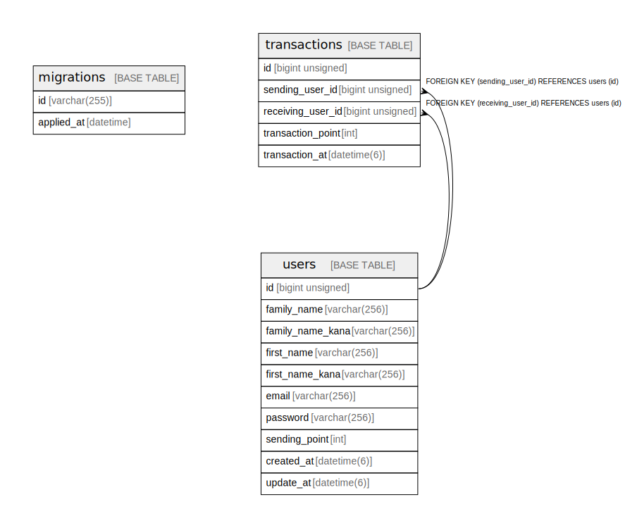

# point_app

## テーブル一覧

| 名前 | カラム一覧 | コメント | タイプ |
| ---- | ------- | ------- | ---- |
| [migrations](migrations.md) | 2 |  | BASE TABLE |
| [transactions](transactions.md) | 5 | 取引 | BASE TABLE |
| [users](users.md) | 10 | ユーザー | BASE TABLE |

## ER図

---

> Generated by [tbls](https://github.com/k1LoW/tbls)
