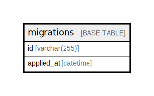

# migrations

## 概要

<details>
<summary><strong>テーブル定義</strong></summary>

```sql
CREATE TABLE `migrations` (
  `id` varchar(255) NOT NULL,
  `applied_at` datetime DEFAULT NULL,
  PRIMARY KEY (`id`)
) ENGINE=InnoDB DEFAULT CHARSET=utf8mb3
```

</details>

## カラム一覧

| 名前 | タイプ | デフォルト値 | Nullable | 子テーブル | 親テーブル | コメント |
| ---- | ------ | ------------ | -------- | ---------- | ---------- | -------- |
| id | varchar(255) |  | false |  |  |  |
| applied_at | datetime |  | true |  |  |  |

## 制約一覧

| 名前 | タイプ | 定義 |
| ---- | ---- | ---------- |
| PRIMARY | PRIMARY KEY | PRIMARY KEY (id) |

## INDEX一覧

| 名前 | 定義 |
| ---- | ---------- |
| PRIMARY | PRIMARY KEY (id) USING BTREE |

## ER図



---

> Generated by [tbls](https://github.com/k1LoW/tbls)
