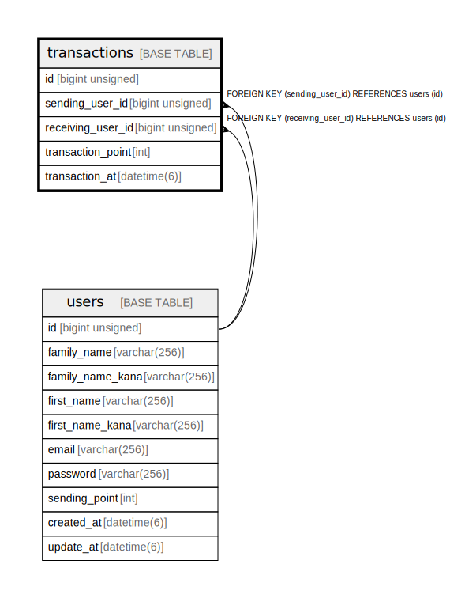

# transactions

## 概要

取引

<details>
<summary><strong>テーブル定義</strong></summary>

```sql
CREATE TABLE `transactions` (
  `id` bigint unsigned NOT NULL AUTO_INCREMENT COMMENT '取引の識別子',
  `sending_user_id` bigint unsigned NOT NULL COMMENT '送信ユーザのID',
  `receiving_user_id` bigint unsigned NOT NULL COMMENT '受信ユーザのID',
  `transaction_point` int NOT NULL COMMENT '取引ポイント',
  `transaction_at` datetime(6) NOT NULL COMMENT '取引日時',
  PRIMARY KEY (`id`),
  KEY `fk_receiving_user_id` (`receiving_user_id`),
  KEY `fk_sending_user_id` (`sending_user_id`),
  CONSTRAINT `transactions_ibfk_1` FOREIGN KEY (`receiving_user_id`) REFERENCES `users` (`id`) ON DELETE CASCADE,
  CONSTRAINT `transactions_ibfk_2` FOREIGN KEY (`sending_user_id`) REFERENCES `users` (`id`) ON DELETE CASCADE
) ENGINE=InnoDB DEFAULT CHARSET=utf8mb4 COLLATE=utf8mb4_0900_ai_ci COMMENT='取引'
```

</details>

## カラム一覧

| 名前 | タイプ | デフォルト値 | Nullable | Extra Definition | 子テーブル | 親テーブル | コメント |
| ---- | ------ | ------------ | -------- | ---------------- | ---------- | ---------- | -------- |
| id | bigint unsigned |  | false | auto_increment |  |  | 取引の識別子 |
| sending_user_id | bigint unsigned |  | false |  |  | [users](users.md) | 送信ユーザのID |
| receiving_user_id | bigint unsigned |  | false |  |  | [users](users.md) | 受信ユーザのID |
| transaction_point | int |  | false |  |  |  | 取引ポイント |
| transaction_at | datetime(6) |  | false |  |  |  | 取引日時 |

## 制約一覧

| 名前 | タイプ | 定義 |
| ---- | ---- | ---------- |
| PRIMARY | PRIMARY KEY | PRIMARY KEY (id) |
| transactions_ibfk_1 | FOREIGN KEY | FOREIGN KEY (receiving_user_id) REFERENCES users (id) |
| transactions_ibfk_2 | FOREIGN KEY | FOREIGN KEY (sending_user_id) REFERENCES users (id) |

## INDEX一覧

| 名前 | 定義 |
| ---- | ---------- |
| fk_receiving_user_id | KEY fk_receiving_user_id (receiving_user_id) USING BTREE |
| fk_sending_user_id | KEY fk_sending_user_id (sending_user_id) USING BTREE |
| PRIMARY | PRIMARY KEY (id) USING BTREE |

## ER図



---

> Generated by [tbls](https://github.com/k1LoW/tbls)
