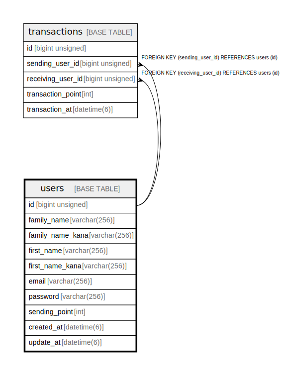

# users

## 概要

ユーザー

<details>
<summary><strong>テーブル定義</strong></summary>

```sql
CREATE TABLE `users` (
  `id` bigint unsigned NOT NULL AUTO_INCREMENT COMMENT 'ユーザーの識別子',
  `family_name` varchar(256) NOT NULL COMMENT '苗字',
  `family_name_kana` varchar(256) NOT NULL COMMENT '苗字カナ',
  `first_name` varchar(256) NOT NULL COMMENT '名前',
  `first_name_kana` varchar(256) NOT NULL COMMENT '名前カナ',
  `email` varchar(256) NOT NULL COMMENT 'メールアドレス',
  `password` varchar(256) NOT NULL COMMENT 'パスワードハッシュ',
  `sending_point` int NOT NULL COMMENT '送信可能ポイント',
  `created_at` datetime(6) NOT NULL COMMENT 'レコード作成日時',
  `update_at` datetime(6) NOT NULL COMMENT 'レコード修正日時',
  PRIMARY KEY (`id`),
  UNIQUE KEY `uix_email` (`email`) USING BTREE
) ENGINE=InnoDB DEFAULT CHARSET=utf8mb4 COLLATE=utf8mb4_0900_ai_ci COMMENT='ユーザー'
```

</details>

## カラム一覧

| 名前 | タイプ | デフォルト値 | Nullable | Extra Definition | 子テーブル | 親テーブル | コメント |
| ---- | ------ | ------------ | -------- | ---------------- | ---------- | ---------- | -------- |
| id | bigint unsigned |  | false | auto_increment | [transactions](transactions.md) |  | ユーザーの識別子 |
| family_name | varchar(256) |  | false |  |  |  | 苗字 |
| family_name_kana | varchar(256) |  | false |  |  |  | 苗字カナ |
| first_name | varchar(256) |  | false |  |  |  | 名前 |
| first_name_kana | varchar(256) |  | false |  |  |  | 名前カナ |
| email | varchar(256) |  | false |  |  |  | メールアドレス |
| password | varchar(256) |  | false |  |  |  | パスワードハッシュ |
| sending_point | int |  | false |  |  |  | 送信可能ポイント |
| created_at | datetime(6) |  | false |  |  |  | レコード作成日時 |
| update_at | datetime(6) |  | false |  |  |  | レコード修正日時 |

## 制約一覧

| 名前 | タイプ | 定義 |
| ---- | ---- | ---------- |
| PRIMARY | PRIMARY KEY | PRIMARY KEY (id) |
| uix_email | UNIQUE | UNIQUE KEY uix_email (email) |

## INDEX一覧

| 名前 | 定義 |
| ---- | ---------- |
| PRIMARY | PRIMARY KEY (id) USING BTREE |
| uix_email | UNIQUE KEY uix_email (email) USING BTREE |

## ER図



---

> Generated by [tbls](https://github.com/k1LoW/tbls)
